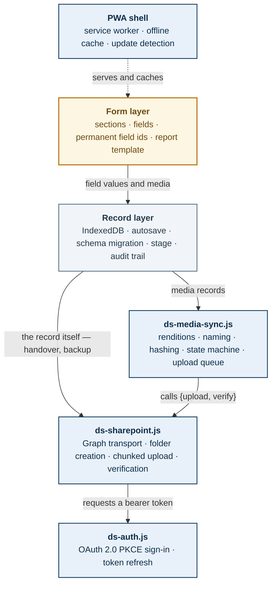
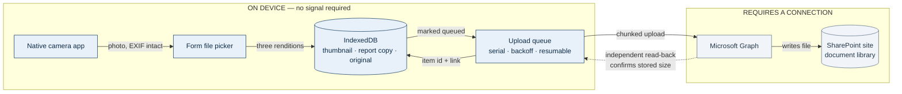
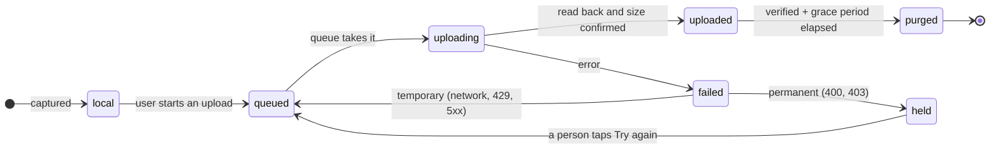
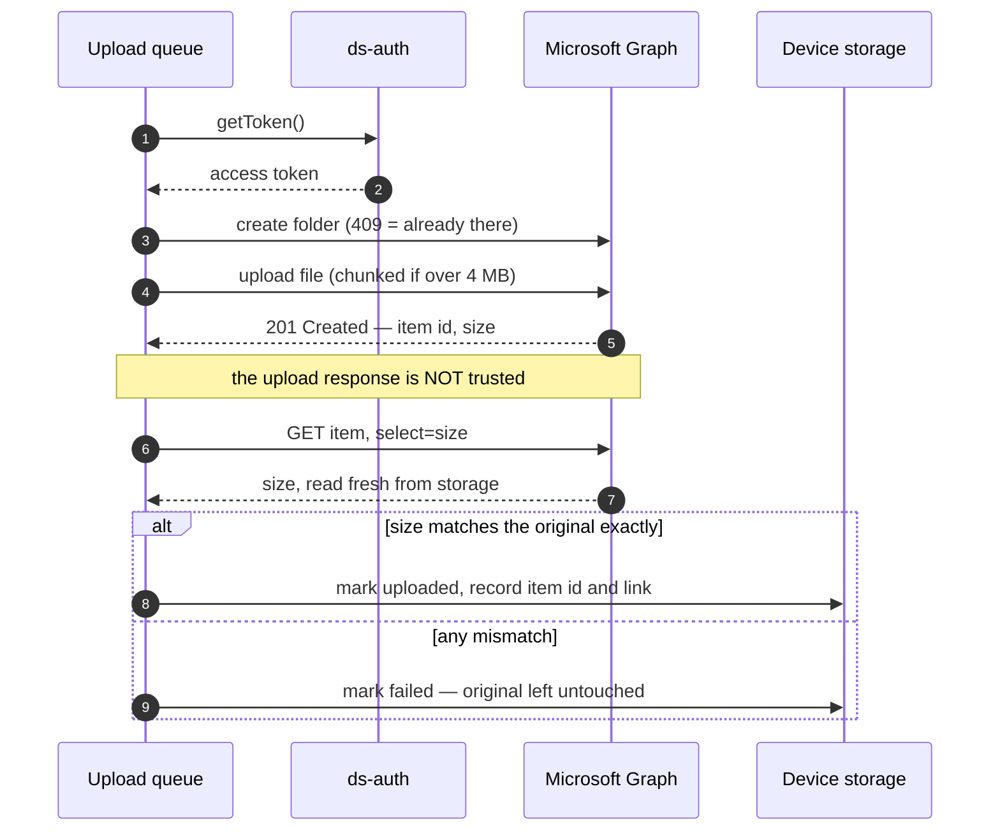
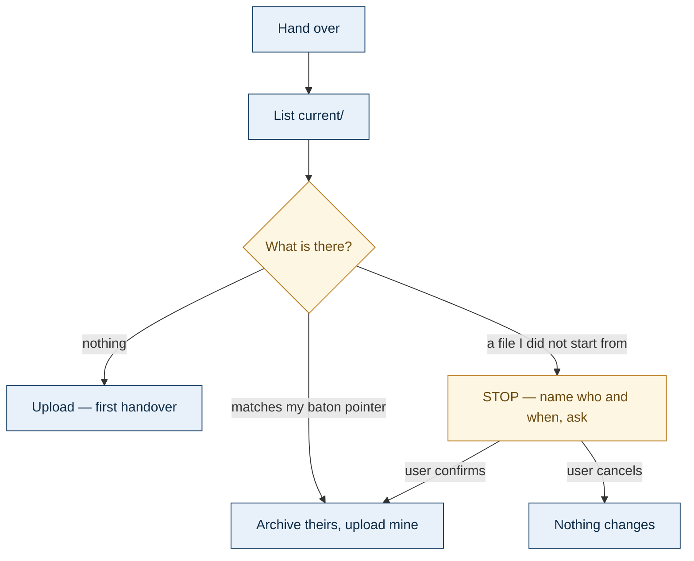
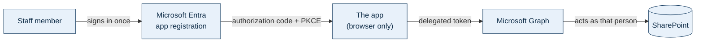
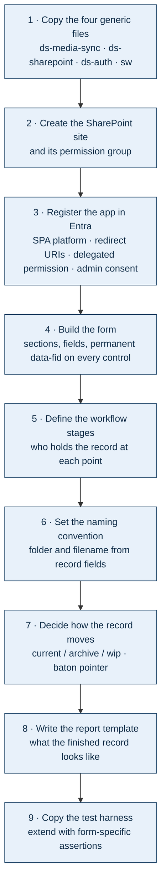

# Dryspace Field App — Architecture & Reuse Template

**What this is:** a complete description of how the Dryspace Site Inspection App is built, written so it can be reused as the specification for a *different* data-capture app.

**How to use it:** paste this whole document into a new AI session and say —

> *Build me an app on this architecture. Keep every layer marked REUSABLE exactly as described. Replace the form layer with the following: [describe your form].*

Everything below the form layer is deliberately independent of what the form asks. That is the point of the design: the form is the only part that should ever need rebuilding.

**Source app:** Dryspace Site Inspection App v1.4 · Form 4.2 · Queensland, Australia
**Planned siblings:** progress inspections · job completion reports · staff competency assessments · tool and equipment damage reports

> ### Move this document when you build the second app
>
> It currently lives inside the Site Inspection App's folder, which is wrong for
> what it is — it describes how Dryspace builds **any** field app, not this one.
> The risk is concrete: when v1.4 ships and v1.3 is moved to Superseded, the
> specification for four unbuilt apps goes with it.
>
> **Intended home:** `00_AI Tools in Development/_Shared/`, alongside the
> Dryspace Context Brief, which is the same shape — it describes the business and
> the trade, not this app.
>
> **This is now imminent rather than hypothetical.** v1.4 is built, and moving
> v1.3 to `Superseded` is the next task on the list. Do the move as part of that
> restructure, not after it — once this folder is superseded, the specification
> for four unbuilt apps is sitting inside an archived directory that nobody has a
> reason to open.
>
> Set up `_Shared` as its own small repository at the same time, so both documents
> keep their history. Moving them breaks cross-references in `CLAUDE.md` and
> `02_Iteration Guide.md`, so fix those in the same pass.
>
> See `docs/DECISION-LOG.md` §4.

---

## 1. The constraint that shapes everything

Dryspace works in basements. **There is no mobile signal where the data is captured.** Every architectural decision below follows from that single fact, and any sibling app inherits it — a progress inspection happens in the same basement as the original inspection.

Three consequences, and they are not negotiable:

1. **Nothing may require a connection at capture time.** No live lookups, no server-side validation, no "save to cloud" on submit. A form that needs the network fails at exactly the moment it is needed.
2. **Uploads are deferred, never synchronous.** Photos are captured to the device and sent later — in the car, at the office, on wifi.
3. **The device is the system of record until an upload is verified.** Nothing on the device is deleted on the strength of a hopeful "upload succeeded" message.

If a sibling app *does* have reliable connectivity (an office-only form, say), this architecture still works — it simply never exercises the offline path.

---

## 2. Architecture

Six layers. One is app-specific; five are not.



**Amber** = rebuild per app. **Blue** = copy unchanged. **Grey** = copy, adjust a little.

The critical property: **each layer talks to the next through a narrow interface**, not by reaching into it.

- The media layer never reads the form. It is handed records and told where to put them.
- The auth layer supplies `getToken()`. It knows nothing about files.
- **The transport is a storage interface, not a photo uploader.** It implements six functions, and swapping SharePoint for anything else means writing those six and nothing more:

| Function | Job |
|---|---|
| `upload(record, meta)` | large binary, chunked above 4 MB |
| `verify(remote)` | independent read-back — see §7 |
| `putSmall(folder, name, blob)` | small file in one request — the record's own JSON |
| `list(folder)` | what is in a folder, for picking a record up |
| `download(item)` | fetch a file back |
| `move(item, toFolder)` | re-parent within the library — archiving |

> **This grew in v1.4, and the reason generalises.** v1.3 shipped with the first two, because photos were the only thing that went to SharePoint. Everything else — handing the record on, taking it over, backing it up — went through the OS share sheet. **On a phone that is not a transfer mechanism at all:** the share sheet offers WhatsApp and Mail, and there is no way to reach the document library. The desktop appeared to work only because SharePoint was a synced drive there.
>
> **The lesson for a sibling app:** if the *record* needs to move between people, the transport needs list/download/move from day one. Designing it as an upload-only path builds in a limitation you will not notice until somebody tries to use it on a phone.

That is what makes the stack reusable rather than merely copyable.

---

## 3. What you reuse, what you rebuild

| Layer | File | Reuse | What changes for a new app |
|---|---|---|---|
| Form | `index.html` (markup) | **Rebuild** | Everything — sections, fields, permanent ids, dynamic reveals, report template |
| Record | `index.html` (script) | Copy, adjust | Workflow stage names; which fields summarise a record on the home screen |
| Media sync | `ds-media-sync.js` | **Copy unchanged** | Nothing |
| Transport | `ds-sharepoint.js` | **Copy unchanged** | Nothing in code — destination is configuration |
| Handover | `index.html` (script) | Copy, adjust | Folder names if your stages differ; the conflict prompt's wording |
| Auth | `ds-auth.js` | **Copy unchanged** | Nothing |
| Shell | `sw.js`, manifest, icons | Copy, rename | Cache name, app name, icons |
| Config | `SP_CONFIG` block | Edit | Site path, redirect URIs, Entra ids |
| Tests | `tests.html` | Copy, extend | Form-specific assertions; all module tests carry over |

Roughly **80% of the code moves across untouched.** The work in a new app is the form and its report — which is as it should be, because that is the only part that is genuinely different.

---

## 4. End-to-end data flow



**Note the camera.** Photos are taken in the **native camera app** and imported through the picker, not captured inside the browser. Two reasons, both load-bearing:

- The camera roll becomes an **independent backup** that exists before the app has the photo and persists after.
- Browser-captured photos generally carry **no EXIF GPS**; native ones do. If location data ever matters to you, it only survives this way.

---

## 5. The three renditions

Every photo is stored three times, each copy with a distinct job:

| Rendition | Size | Purpose |
|---|---|---|
| Thumbnail | 240 px | Previews inside the form |
| Report copy | 1600 px, JPEG q0.72 | Embedded in the emailed report — keeps it deliverable |
| Original | Untouched | The evidence copy that goes to SharePoint |

Video and PDFs keep **one** copy — duplicating a 500 MB video would consume the device's storage for nothing.

A typical phone photo drops from ~4 MB to ~250 KB for the report copy, which is what keeps a 40-photo report emailable.

---

## 6. Photo lifecycle



Two rules that matter more than they look:

**Illegal transitions throw rather than silently corrupting state.** `local → purged` is impossible by construction — a file cannot be deleted without having been uploaded first.

**Permanent failures are held, not retried.** A `400` or `403` will never succeed on its own. Retrying forever burns battery and hides the real cause behind a spinner. Held files wait for a person.

---

## 7. Why an upload is verified separately

This is the part most implementations get wrong, and it is why nothing is deleted on trust.



**A `201 Created` can be returned on a truncated write.** The only thing that proves what is actually stored is reading it back. So the queue always issues a second, independent request, and compares the stored size to the original byte for byte.

Only a record that has passed that check becomes eligible for its local original to be removed — and even then, never automatically and never before a grace period.

---

## 8. How a deferred queue hangs, and what stops it

Everything in §7 assumes requests eventually return. **The hardest failures in this app were not errors — they were operations that never finished**, and an app that shows *"Uploading…"* for ever is worse than one that fails, because nobody knows to do anything about it.

Four distinct hang shapes were found in a live build. **Each needs its own guard; none of the guards catches the others.** A sibling app inherits all four.

### 1 · A request that never answers

The obvious one. `AbortController` with a deadline on every request — 30 s for metadata, longer for a chunk on a weak connection.

### 2 · The deadline that does not cover the operation

**The trap.** `getToken()` is awaited *before* the request is issued, so it sits outside the request's own deadline. A sign-in server that never answers hangs the upload with nothing sent and nothing on screen — the earliest and least visible stall in the chain.

> **Adding a timeout to the visible call is not the same as bounding the operation.** Ask what else runs before the thing you wrapped. Give the token layer its own deadline *and* bound the call from outside.

**And: a timed-out token must not sign anyone out.** A server that never answered says nothing about whether the refresh token is good. Only an actual rejection clears credentials — otherwise a moment of bad signal forces a re-authentication in the field, which is exactly where it is hardest to do.

### 3 · Progress that is answered but never advances

A chunked upload session can answer every request promptly, correctly, and for ever without the file advancing — the server replies "resume at byte N" pointing back at bytes already sent. **Every request succeeds, every deadline is met, nothing finishes.** No per-request timeout can see this.

Two guards, and both are needed:

- **Require forward progress.** Re-sending a chunk once or twice is legitimate; three non-advancing answers ends the attempt. Retry from a fresh session — that is the actual remedy.
- **A deadline on the whole file**, not just each request.

> **This survived every test the path had**, because a fake transport always advances. If you test a resumable protocol, test the case where the server does not progress — it is the one that hangs in production.

### 4 · A stall inside the request body

A blob read from IndexedDB can come back unreadable — Safari has a long history of this. Handed to `fetch` as a request body, **a stall there is invisible to a deadline waiting on a response.**

**Read the file before sending it.** One small slice proves the handle is live and turns a permanent hang into a named failure. Check the size against what the record expects while you are there. Cheap: 64 KB against a 5 MB upload.

Treat an unreadable file as **permanent** — retrying cannot restore a blob the browser has lost, and only retaking the photo can. Treat a *slow* read as temporary. They are different failures and must be classified differently or the queue either gives up on good files or retries dead ones for ever.

### And the state machine itself

**Every non-terminal state needs a recovery path at start-up.** A record left mid-`uploading` when the app was killed is interrupted by definition — nothing can still be in flight after a reload. If the queue does not reset it, and the "what is pending" count does not include it, the record is stranded permanently and invisible to both. It never uploads, and nothing says so.

> Enumerate the states. For each, ask: *if the app dies here, what brings this back?* Then write the test that kills it there.

### What to build in from version 1

- [ ] A deadline on every request, including the token request
- [ ] A deadline on every multi-request operation, not only its parts
- [ ] Forward-progress checks on anything resumable
- [ ] Read a stored file before sending it
- [ ] Reset non-terminal states at start-up
- [ ] **Per-file status on screen, with the actual reason on failure.** The field report that started all of this was not *"it failed"* — it was *"I cannot tell what it is doing."* That is a reporting defect, not an upload defect, and it is the one that wastes the most time
- [ ] A diagnostics page that runs **on the failing device** and reports which layer is at fault

> **On that last point.** The mobile fault in v1.3 could not be reproduced on a desk, and reading the code found three separate defects capable of causing it — which meant three plausible stories and no way to choose between them. A page that runs on the phone and answers *which one* is worth building the first time you cannot reproduce something, not the third.

---

## 9. Storage layout and naming

```
SharePoint site  (its own site, its own permission group)
└── Shared Documents/
    └── INS-2026-0142 - Smith - 12 Marine Parade, Kirra/
        ├── current/     exactly one file, ever — THE LIVE RECORD
        │   └── DS_Draft_INS-2026-0142_Smith_S02-FIELD_2026-08-15T1430_JS.json
        ├── archive/     the frozen file from every past handover
        ├── wip/         automatic backups of work in progress — NEVER the record
        │   └── WIP_INS-2026-0142_<device>.json
        └── photos/
            ├── INS-2026-0142_Smith_2026-08-14_s4-wall-moisture-signs_001.jpg
            └── INS-2026-0142_Smith_2026-08-14_s3a-access-discharge-hazards_001.jpg
```

**Folder** carries the human-readable identity (record number + address). **Filename** carries record number, date, which form field it came from, and a sequence.

**Photos sit in their own subfolder** so they cannot drown `current/` and `archive/` — the two folders a person actually opens at handover. Fifty photos above them and nobody finds the record.

**`wip/` is one file per device, `current/` is one file full stop.** That asymmetry is deliberate and is explained in §10.

Four rules learned the hard way:

- **Sanitise for SharePoint.** It rejects `" * : < > ? / \ |` outright, plus reserved device names (`CON`, `LPT1`), and leading or trailing dots. Australian addresses contain slashes routinely — "Unit 3/12 Marine Pde" — so this is not theoretical.
- **Pin the folder on first upload.** Derive it from the record, then store it. Otherwise someone correcting a typo in the address later splits one job's photos across two folders with nothing to indicate it happened.
- **Fix the sequence number at capture.** A retry must overwrite the same name, not create a duplicate.
- **Never move files between libraries.** Item ids survive moves and renames *within* a library, but a cross-library move is a copy-and-delete — every stored link breaks. If files must be filed elsewhere, place a shortcut instead.

---

## 10. Moving the record between people

The media architecture above answers *where do the photos go*. This answers *where does the record itself go* — and for any app where work passes between people, it is the harder half.

**The problem.** There is no live sync (§1 forbids it). So at any moment exactly one copy must be authoritative, and the app has to make that true without a server to arbitrate.

**The rule:** *one baton, never a copy.* Exactly one file is the live record; it lives in `current/`; the copy on a device is a scratch pad.

### The three folders do three different jobs

| Folder | Holds | Written when |
|---|---|---|
| `current/` | **the baton** — exactly one file | a deliberate handover |
| `archive/` | every previous baton, frozen | automatically, at each handover |
| `wip/` | a working copy per device | quietly, while someone edits |

> **`wip/` exists because of a question worth asking out loud.** The obvious design is to auto-save into `current/`. Do not: `current/` changing without a deliberate handover breaks the one promise the protocol makes, and the moment a background write can land there, "exactly one authoritative file" stops being true. A separate folder keeps the guarantee intact and still gets the work off the device. **A backup and a handover are different events and must not share a destination.**

### Detecting a second device, without a server

A record carries a pointer to the baton it came from:

```
baton: { itemId, name, at, by }
```

Set when the record is taken over or handed on. At the next handover, the app lists `current/` and compares. Three outcomes:

- **Empty** — first handover. Upload.
- **Matches the pointer** — nobody else has touched it. Archive theirs, upload yours.
- **Does not match** — somebody handed this on after you picked it up. **Stop and ask**, naming who and when. Continuing archives their version rather than destroying it.



**Why a pointer and not a timestamp.** Clocks on field devices are not reliable, and a comparison of "mine is newer" silently picks a winner. A pointer answers a different and better question — *is this the same file I started from?* — which has no false confidence in it. It cannot merge; nothing here can. It can refuse to overwrite silently, which is the whole objective.

**Archive, never delete.** The losing version moves to `archive/`. It stops being the baton; it does not stop existing. In an app with no undo, "the app quietly destroyed a day of work" is the failure worth engineering against.

### What stays human

The app files the record and archives the previous one. **It does not delete the device copy.** Deleting somebody's only copy of a day's work on their behalf, based on the app's own belief that the upload worked, is not a risk worth taking — and the person who has just handed over is the one who knows whether the next person actually has it.

---

## 11. Identity and permissions



- **OAuth 2.0 authorization code with PKCE.** No client secret exists anywhere, which is why the client and tenant ids can live in a public repository. The secret is generated on the device per sign-in and never leaves it.
- **Delegated permission (`Files.ReadWrite.All`)** — the app can only ever reach what the signed-in person can already reach. It never elevates.
- **Admin consent is required once per tenant.** Not because of the permission's default, but because most tenants restrict user consent for apps without a verified publisher.
- **Being offline never signs anyone out.** A failed token refresh caused by no connection leaves credentials intact; only an actual rejection clears them.
- **Concurrent uploads share one token refresh.** Entra rotates refresh tokens on every use and invalidates the previous one, so three uploads starting together must not each try to spend the same single-use token.

### Recommendation for sibling apps

**One Entra app registration per app**, not one shared across all. Slightly more setup, but each app's permissions, consent and audit trail stay separate — and revoking one does not revoke the rest.

**One SharePoint site per data domain.** Keep inspection media apart from HR material apart from equipment records, because the permission groups genuinely differ.

> **Flag for the competency-assessment app:** staff assessments are HR-sensitive personal data about identifiable employees. That belongs in a site whose permission group is HR, not the field team — a different boundary from anything in the inspection app. Worth deciding before it is built, not after.

---

## 12. The record layer

Independent of media, and equally reusable.

- **IndexedDB, not localStorage.** Photos are blobs; localStorage holds strings and caps out around 5 MB.
- **Continuous autosave, debounced ~400 ms**, plus a forced save on `pagehide` and `visibilitychange`. A flat battery loses nothing.
- **Permanent field ids (`data-fid`).** Answers are stored against a build-time id, never against the label text. Reword a question or move it to another section and the saved data still resolves. *This is the single most valuable thing in the record layer* — the original app stored against labels and every rewording silently orphaned data.
- **Versioned schema with a migration chain.** Each record carries a schema number; `ensureSchema()` runs upgrades in order, and anything unrecognised is preserved under an `unmapped:` prefix rather than discarded.
- **Stage tracking and audit trail.** Which stage the record is at, who last edited it, and a log of every stage change, import and migration. The trail travels inside exported files, so history survives handover.
- **One baton, never a copy.** With no live sync, exactly one file is the live record at any moment — see §10, which is where the mechanism lives.

> **One trap worth naming, because it is silent and it is easy.** `ensureSchema()` owns the record's schema number and **nothing else may set it**. The save path once pinned it to a literal, which was harmless until the schema moved — after which every record migrated correctly on load and was written straight back at the old number, on every save, with no error. Migrations appeared to work and nothing persisted. If you add a migration step, grep for the number you are leaving behind before you trust it.

---

## 13. The PWA shell

- Installs to the home screen; runs as an app, not a browser tab.
- **Cache-first**, deliberately. Network-first would make every launch wait on the network, and in marginal signal that is a hang before the app appears.
- **Updates are announced, not silent.** The service worker does not activate a new build on its own; it waits, and the app shows *"A new version is ready"* with an Update button. There is also a manual "Check for update".
- **Updating refuses while a record is open**, because applying one reloads the page.

> **Carry this into every sibling app.** A cache-first app cannot be told about new code retrospectively — a device already running an old build has no banner. Build the update mechanism into version 1, or the first update will have to be delivered by asking people to close and reopen the app.

---

## 14. Testing approach

Worth copying wholesale, because it caught real defects.

- A single `tests.html` drives the **real functions in the app** through a hidden iframe. Nothing is copied into the test file, so tests cannot drift from shipping code.
- The **upload queue is tested against a fake transport** — success, truncated upload, throttling, permanent failure, offline. This found two bugs that reading the code did not: a transient error stranding a photo forever, and permanent errors being retried to the cap.
- **Migration is verified against the real previous build**, loaded as a fixture, rather than a synthetic record.
- **Release gates** assert that the service worker cache name carries the app version — a forgotten bump is silent and leaves every installed device on the old build.

- **Adversarial cases carry more weight than happy ones.** The tests that earned their keep were: a truncated upload reporting success, a record killed mid-flight, a resumable session that answers without advancing, a stored file that will not read, and a token server that never replies. Every one of those was a real defect. None would have been caught by testing that an upload works.

One trap: the service worker will serve the test harness itself from cache, so the harness clears caches and navigates once before running. Otherwise it can pass against yesterday's code.

---

## 15. Building a new app from this template



**Checklist for the form layer — the only part you actually design:**

- [ ] Every control carries a permanent `data-fid`, assigned once and never changed
- [ ] Every file input carries a permanent `data-mfid`
- [ ] Radio and checkbox options have stable values independent of their display text
- [ ] Labels are associated with inputs (`for` / `id`) for accessibility
- [ ] Which fields identify a record — they become the folder name and the home-screen summary
- [ ] Which fields are required before an upload makes sense
- [ ] Workflow stages named for who actually holds the record

**And before you write the transport — two questions that are expensive to answer late:**

- [ ] **Does the record move between people?** If so, build `list`/`download`/`move` into the transport now (§2). An upload-only transport works until somebody tries to hand a record on from a phone.
- [ ] **What happens if the device is lost mid-job?** If the answer is "the work is gone", you need `wip/` (§10). It is a few hundred bytes of code and it is the largest single data risk in an offline-first app.

---

## 16. Decisions already settled

Recorded so a future build does not relitigate them.

| Decision | Why |
|---|---|
| SharePoint, not Google Drive | The record's own handover files already live there; splitting one job across two clouds is the fragmentation the baton rule exists to prevent |
| Media in its own site, not client folders | Client folders hold quotes and pricing; delegated permissions would give field staff access to all of it |
| No client folder picker | Records are created ad hoc without SharePoint access; requiring a lookup would block or delay uploads |
| Files never move between libraries | Item ids do not survive a cross-library move, and every stored link would break |
| Deferred upload queue, not upload-on-tap | There is no signal at capture time |
| Hand-written auth, not MSAL | ~150 lines against ~200 KB in an app whose defining property is being self-contained; one tenant, one scope, one account per device |
| Cache-first service worker | Instant launch matters more than instant updates when the alternative is a hang in a basement |
| Capture never blocked by storage warnings | Running out of space is recoverable; an un-photographed defect is not |
| Full-resolution originals kept | These are warranty and dispute evidence |
| The record moves through storage, not the OS share sheet | The share sheet has no route to a document library on a phone; it offers messaging apps. Desktop only appeared to work because the library was a synced drive |
| Auto-backup writes to `wip/`, never to `current/` | A background write landing in `current/` breaks the one guarantee the baton protocol makes. A backup and a handover are different events |
| Conflicts are detected by a **baton pointer**, not by timestamp | Field device clocks are not reliable, and "mine is newer" silently picks a winner. "Is this the same file I started from?" has no false confidence in it |
| The losing version is **archived, never deleted** | In an app with no undo, quietly destroying a day's work is the failure worth engineering against |
| The app does not delete the device copy after a handover | Deleting somebody's only copy on the strength of the app's own belief that an upload worked is not a risk worth taking |
| Every multi-request operation gets its own deadline | Per-request timeouts cannot bound an operation that keeps answering without progressing (§8) |

---

## 17. Known limits

Honest about what this architecture does *not* do:

- **No live cross-device sync.** Handover moves a file when somebody taps the button. Two people cannot edit one record at once — the app detects that afterwards and refuses to overwrite silently, but it cannot merge, and nothing in this architecture can.
- **The automatic backup is a safety net, not a sync.** It writes to `wip/`; it does not tell another device anything.
- **Nothing is ever deleted from storage by the app.** Archives and `wip/` files accumulate. That is deliberate — but it means retention is somebody's manual job, and worth deciding before a library has ten thousand folders in it.
- **Video does not travel inside exported drafts or reports** — too large. It uploads to SharePoint but is shared separately.
- **HEIC on Windows.** iOS converts to JPEG at the file picker so it works there; a Windows browser cannot decode HEIC and stores the original unconverted.
- **Admin consent is a hard dependency.** Uploads cannot work until a tenant administrator approves the app once.
- **Analytics across records is not built.** Querying "every job with a leaking wall-floor junction" needs a structured database downstream; the apps produce the data for it but do not provide it.
