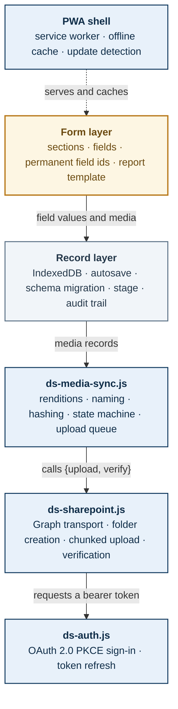
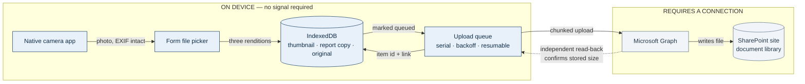
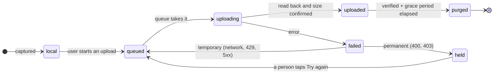
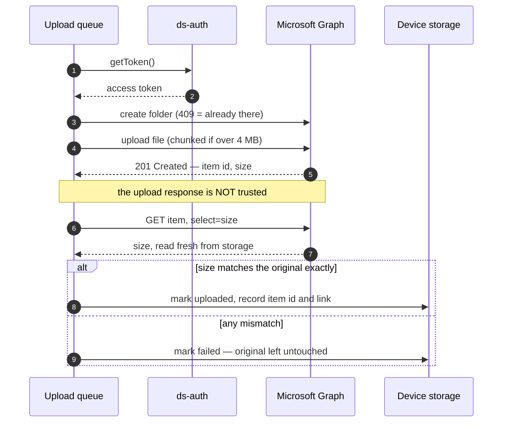
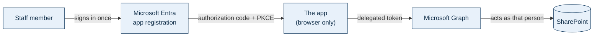
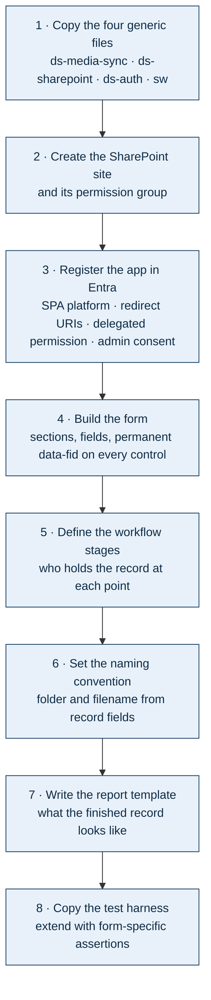

# Dryspace Field App — Architecture & Reuse Template

**What this is:** a complete description of how the Dryspace Site Inspection App is built, written so it can be reused as the specification for a *different* data-capture app.

**How to use it:** paste this whole document into a new AI session and say —

> *Build me an app on this architecture. Keep every layer marked REUSABLE exactly as described. Replace the form layer with the following: [describe your form].*

Everything below the form layer is deliberately independent of what the form asks. That is the point of the design: the form is the only part that should ever need rebuilding.

**Source app:** Dryspace Site Inspection App v1.3 · Form 4.2 · Queensland, Australia
**Planned siblings:** progress inspections · job completion reports · staff competency assessments · tool and equipment damage reports

---

## 1. The constraint that shapes everything

Dryspace works in basements. **There is no mobile signal where the data is captured.** Every architectural decision below follows from that single fact, and any sibling app inherits it — a progress inspection happens in the same basement as the original inspection.

Three consequences, and they are not negotiable:

1. **Nothing may require a connection at capture time.** No live lookups, no server-side validation, no "save to cloud" on submit. A form that needs the network fails at exactly the moment it is needed.
2. **Uploads are deferred, never synchronous.** Photos are captured to the device and sent later — in the car, at the office, on wifi.
3. **The device is the system of record until an upload is verified.** Nothing on the device is deleted on the strength of a hopeful "upload succeeded" message.

If a sibling app *does* have reliable connectivity (an office-only form, say), this architecture still works — it simply never exercises the offline path.

---

## 2. Architecture

Six layers. One is app-specific; five are not.



**Amber** = rebuild per app. **Blue** = copy unchanged. **Grey** = copy, adjust a little.

The critical property: **each layer talks to the next through a narrow interface**, not by reaching into it.

- The media layer never reads the form. It is handed records and told where to put them.
- The transport implements exactly two functions — `upload(record, meta)` and `verify(remote)`. Swapping SharePoint for anything else means writing those two functions and nothing more.
- The auth layer supplies `getToken()`. It knows nothing about files.

That is what makes the stack reusable rather than merely copyable.

---

## 3. What you reuse, what you rebuild

| Layer | File | Reuse | What changes for a new app |
|---|---|---|---|
| Form | `index.html` (markup) | **Rebuild** | Everything — sections, fields, permanent ids, dynamic reveals, report template |
| Record | `index.html` (script) | Copy, adjust | Workflow stage names; which fields summarise a record on the home screen |
| Media sync | `ds-media-sync.js` | **Copy unchanged** | Nothing |
| Transport | `ds-sharepoint.js` | **Copy unchanged** | Nothing in code — destination is configuration |
| Auth | `ds-auth.js` | **Copy unchanged** | Nothing |
| Shell | `sw.js`, manifest, icons | Copy, rename | Cache name, app name, icons |
| Config | `SP_CONFIG` block | Edit | Site path, redirect URIs, Entra ids |
| Tests | `tests.html` | Copy, extend | Form-specific assertions; all module tests carry over |

Roughly **80% of the code moves across untouched.** The work in a new app is the form and its report — which is as it should be, because that is the only part that is genuinely different.

---

## 4. End-to-end data flow



**Note the camera.** Photos are taken in the **native camera app** and imported through the picker, not captured inside the browser. Two reasons, both load-bearing:

- The camera roll becomes an **independent backup** that exists before the app has the photo and persists after.
- Browser-captured photos generally carry **no EXIF GPS**; native ones do. If location data ever matters to you, it only survives this way.

---

## 5. The three renditions

Every photo is stored three times, each copy with a distinct job:

| Rendition | Size | Purpose |
|---|---|---|
| Thumbnail | 240 px | Previews inside the form |
| Report copy | 1600 px, JPEG q0.72 | Embedded in the emailed report — keeps it deliverable |
| Original | Untouched | The evidence copy that goes to SharePoint |

Video and PDFs keep **one** copy — duplicating a 500 MB video would consume the device's storage for nothing.

A typical phone photo drops from ~4 MB to ~250 KB for the report copy, which is what keeps a 40-photo report emailable.

---

## 6. Photo lifecycle



Two rules that matter more than they look:

**Illegal transitions throw rather than silently corrupting state.** `local → purged` is impossible by construction — a file cannot be deleted without having been uploaded first.

**Permanent failures are held, not retried.** A `400` or `403` will never succeed on its own. Retrying forever burns battery and hides the real cause behind a spinner. Held files wait for a person.

---

## 7. Why an upload is verified separately

This is the part most implementations get wrong, and it is why nothing is deleted on trust.



**A `201 Created` can be returned on a truncated write.** The only thing that proves what is actually stored is reading it back. So the queue always issues a second, independent request, and compares the stored size to the original byte for byte.

Only a record that has passed that check becomes eligible for its local original to be removed — and even then, never automatically and never before a grace period.

---

## 8. Storage layout and naming

```
SharePoint site  (its own site, its own permission group)
└── Shared Documents/
    └── INS-2026-0142 - Smith - 12 Marine Parade, Kirra/
        ├── INS-2026-0142_Smith_2026-08-14_s4-wall-moisture-signs_001.jpg
        ├── INS-2026-0142_Smith_2026-08-14_s4-wall-moisture-signs_002.jpg
        └── INS-2026-0142_Smith_2026-08-14_s3a-access-discharge-hazards_001.jpg
```

**Folder** carries the human-readable identity (record number + address). **Filename** carries record number, date, which form field it came from, and a sequence.

Four rules learned the hard way:

- **Sanitise for SharePoint.** It rejects `" * : < > ? / \ |` outright, plus reserved device names (`CON`, `LPT1`), and leading or trailing dots. Australian addresses contain slashes routinely — "Unit 3/12 Marine Pde" — so this is not theoretical.
- **Pin the folder on first upload.** Derive it from the record, then store it. Otherwise someone correcting a typo in the address later splits one job's photos across two folders with nothing to indicate it happened.
- **Fix the sequence number at capture.** A retry must overwrite the same name, not create a duplicate.
- **Never move files between libraries.** Item ids survive moves and renames *within* a library, but a cross-library move is a copy-and-delete — every stored link breaks. If files must be filed elsewhere, place a shortcut instead.

---

## 9. Identity and permissions



- **OAuth 2.0 authorization code with PKCE.** No client secret exists anywhere, which is why the client and tenant ids can live in a public repository. The secret is generated on the device per sign-in and never leaves it.
- **Delegated permission (`Files.ReadWrite.All`)** — the app can only ever reach what the signed-in person can already reach. It never elevates.
- **Admin consent is required once per tenant.** Not because of the permission's default, but because most tenants restrict user consent for apps without a verified publisher.
- **Being offline never signs anyone out.** A failed token refresh caused by no connection leaves credentials intact; only an actual rejection clears them.
- **Concurrent uploads share one token refresh.** Entra rotates refresh tokens on every use and invalidates the previous one, so three uploads starting together must not each try to spend the same single-use token.

### Recommendation for sibling apps

**One Entra app registration per app**, not one shared across all. Slightly more setup, but each app's permissions, consent and audit trail stay separate — and revoking one does not revoke the rest.

**One SharePoint site per data domain.** Keep inspection media apart from HR material apart from equipment records, because the permission groups genuinely differ.

> **Flag for the competency-assessment app:** staff assessments are HR-sensitive personal data about identifiable employees. That belongs in a site whose permission group is HR, not the field team — a different boundary from anything in the inspection app. Worth deciding before it is built, not after.

---

## 10. The record layer

Independent of media, and equally reusable.

- **IndexedDB, not localStorage.** Photos are blobs; localStorage holds strings and caps out around 5 MB.
- **Continuous autosave, debounced ~400 ms**, plus a forced save on `pagehide` and `visibilitychange`. A flat battery loses nothing.
- **Permanent field ids (`data-fid`).** Answers are stored against a build-time id, never against the label text. Reword a question or move it to another section and the saved data still resolves. *This is the single most valuable thing in the record layer* — the original app stored against labels and every rewording silently orphaned data.
- **Versioned schema with a migration chain.** Each record carries a schema number; `ensureSchema()` runs upgrades in order, and anything unrecognised is preserved under an `unmapped:` prefix rather than discarded.
- **Stage tracking and audit trail.** Which stage the record is at, who last edited it, and a log of every stage change, import and migration. The trail travels inside exported files, so history survives handover.
- **One baton, never a copy.** With no live sync, exactly one file is the live record at any moment. Export, upload, archive the previous, *then* delete your device copy.

---

## 11. The PWA shell

- Installs to the home screen; runs as an app, not a browser tab.
- **Cache-first**, deliberately. Network-first would make every launch wait on the network, and in marginal signal that is a hang before the app appears.
- **Updates are announced, not silent.** The service worker does not activate a new build on its own; it waits, and the app shows *"A new version is ready"* with an Update button. There is also a manual "Check for update".
- **Updating refuses while a record is open**, because applying one reloads the page.

> **Carry this into every sibling app.** A cache-first app cannot be told about new code retrospectively — a device already running an old build has no banner. Build the update mechanism into version 1, or the first update will have to be delivered by asking people to close and reopen the app.

---

## 12. Testing approach

Worth copying wholesale, because it caught real defects.

- A single `tests.html` drives the **real functions in the app** through a hidden iframe. Nothing is copied into the test file, so tests cannot drift from shipping code.
- The **upload queue is tested against a fake transport** — success, truncated upload, throttling, permanent failure, offline. This found two bugs that reading the code did not: a transient error stranding a photo forever, and permanent errors being retried to the cap.
- **Migration is verified against the real previous build**, loaded as a fixture, rather than a synthetic record.
- **Release gates** assert that the service worker cache name carries the app version — a forgotten bump is silent and leaves every installed device on the old build.

One trap: the service worker will serve the test harness itself from cache, so the harness clears caches and navigates once before running. Otherwise it can pass against yesterday's code.

---

## 13. Building a new app from this template



**Checklist for the form layer — the only part you actually design:**

- [ ] Every control carries a permanent `data-fid`, assigned once and never changed
- [ ] Every file input carries a permanent `data-mfid`
- [ ] Radio and checkbox options have stable values independent of their display text
- [ ] Labels are associated with inputs (`for` / `id`) for accessibility
- [ ] Which fields identify a record — they become the folder name and the home-screen summary
- [ ] Which fields are required before an upload makes sense
- [ ] Workflow stages named for who actually holds the record

---

## 14. Decisions already settled

Recorded so a future build does not relitigate them.

| Decision | Why |
|---|---|
| SharePoint, not Google Drive | The record's own handover files already live there; splitting one job across two clouds is the fragmentation the baton rule exists to prevent |
| Media in its own site, not client folders | Client folders hold quotes and pricing; delegated permissions would give field staff access to all of it |
| No client folder picker | Records are created ad hoc without SharePoint access; requiring a lookup would block or delay uploads |
| Files never move between libraries | Item ids do not survive a cross-library move, and every stored link would break |
| Deferred upload queue, not upload-on-tap | There is no signal at capture time |
| Hand-written auth, not MSAL | ~150 lines against ~200 KB in an app whose defining property is being self-contained; one tenant, one scope, one account per device |
| Cache-first service worker | Instant launch matters more than instant updates when the alternative is a hang in a basement |
| Capture never blocked by storage warnings | Running out of space is recoverable; an un-photographed defect is not |
| Full-resolution originals kept | These are warranty and dispute evidence |

---

## 15. Known limits

Honest about what this architecture does *not* do:

- **No live cross-device sync.** Handover is by exported file plus the baton protocol. Two people cannot edit one record at once.
- **Video does not travel inside exported drafts or reports** — too large. It uploads to SharePoint but is shared separately.
- **HEIC on Windows.** iOS converts to JPEG at the file picker so it works there; a Windows browser cannot decode HEIC and stores the original unconverted.
- **Admin consent is a hard dependency.** Uploads cannot work until a tenant administrator approves the app once.
- **Analytics across records is not built.** Querying "every job with a leaking wall-floor junction" needs a structured database downstream; the apps produce the data for it but do not provide it.
